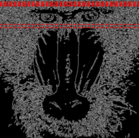
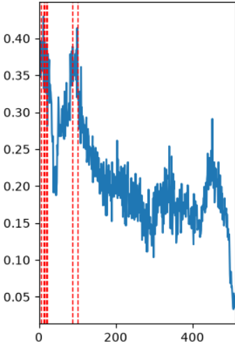
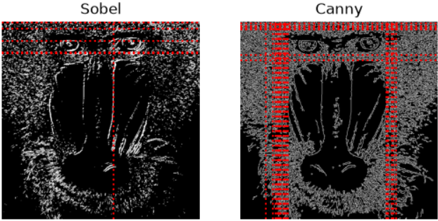
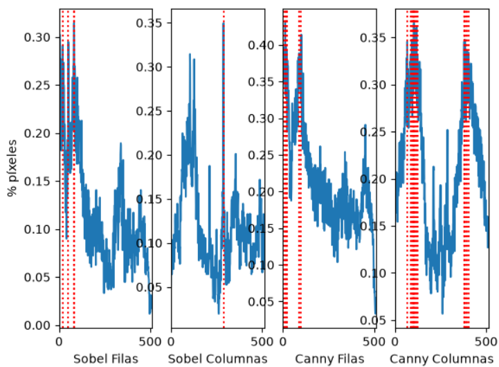
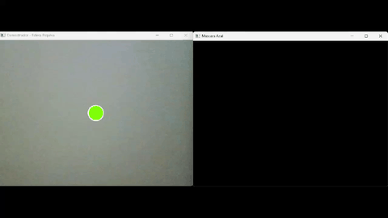

# Tarea 1: Píxeles blancos por fila

Este código analiza la densidad de píxeles que detecta el algoritmo de Canny para identificar las filas con mayor concentración de bordes y representarlas gráficamente.

* **Canny:** Usa este detector de contornos para crear una copia de la imagen original donde solo se dejan los bordes.
* **Obtención de filas:** Utiliza la función `cv2.reduce` sobre la imagen binarizada `canny` para sumar los valores de los píxeles a lo largo de cada fila. Para luego normalizar los recuentos y así obtener la proporción de píxeles blancos por fila.
* **Imagen Canny:** Como se ve en la imagen, se pinta sobre ella unas líneas horizontales (`plt.axhline`) en las filas que representan las filas donde la proporción de píxeles blancos supera el 90% del máximo (`filas.max() * 0.90`).



* **Perfil de densidad:** En esta gráfica de línea, se representa el porcentaje de píxeles blancos por fila, y se señalan con líneas verticales rojas todas aquellas que superan el objetivo.



###

# Tarea 2: Canny y Sobel umbralizados

El siguiente código realiza una binarización mediante umbralizado sobre los resultados de los detectores de bordes Sobel y Canny, para luego analizar la densidad de píxeles tanto por filas como por columnas, tras ello, se comparan las respuestas de ambos métodos.

* **Umbralización binaria:** Se aplica la función `cv2.threshold` sobre las imágenes `sobel8` y `canny` utilizando un `valorUmbral` para obtener las máscaras binarias de bordes (`imagenUmbralizadaSobel` e `imagenUmbralizadaCanny`).
* **Cálculo de perfiles de densidad:** Suma las intensidades de los píxeles a lo largo de las filas y de las columnas. Posteriormente, normaliza estos recuentos dividiendo entre el número total de píxeles en esa dirección multiplicados por 255.
* **Superposición visual y trazado de ejes:** Como se ve en la imagen, se muestran las binarizaciones marcando con líneas rojas aquellas filas y columnas cuya densidad de bordes supera el 90% del valor máximo en sus respectivas orientaciones.



* **Análisis por histogramas/perfiles:** Se genera los siguientes gráficos de línea de para comparar el % de píxeles activos por cada fila y columna entre los algoritmos de Sobel y Canny.



### Comparación entre Sobel y Canny

* **Detección de textura y ruido:** Canny detecta muchos bordes finos en el pelaje, mientras que Sobel filtra mejor el ruido y se centra en los contrastes más marcados.
* **Marcado de filas y columnas:** En Sobel, las líneas se concentran solo en zonas muy concretas (como las cejas y la nariz). En Canny, la acumulación de bordes en el pelaje hace que varias columnas y filas superen el umbral.
* **Grosor del borde:** Sobel produce bordes más gruesos y difusos, mientras que Canny los afina a un único píxel, generando un mapa de contornos más detallado pero más saturado.

# Tarea 3: Detección de Objetos por Color e Interacción Dinámica

## Descripción General
La tarea consiste en detectar objetos de color azul en tiempo real mediante la cámara web para interactuar de forma dinámica con una pelota (esfera virtual) mostrada en pantalla, provocando que esta sea repelida al acercarse el objeto.

El aislamiento del color se realiza en el espacio de color HSV (*Hue, Saturation, Value*) para generar una máscara binaria. Esto aporta mayor robustez frente a variaciones de iluminación en comparación con el espacio BGR.

---

#### 1. Inicialización de Parámetros y Calibración del Rango de Color

Antes de iniciar el bucle principal, se configuran las propiedades cinemáticas de la pelota (radio, posición inicial, velocidad y radio de seguridad/repulsión) y los umbrales de segmentación cromática en HSV para el tono azul:

```python
import cv2
import numpy as np

vid = cv2.VideoCapture(0)

# Estado inicial de la esfera
radio_esfera = 25
pos_x = 320.0
pos_y = 240.0
vel_x = 0.0
vel_y = 0.0
distancia_seguridad = 150  # Umbral de proximidad para iniciar la repulsión

# Rango de color azul en el espacio HSV
azul_bajo = np.array([95, 120, 70])
azul_alto = np.array([130, 255, 255])
```

---

#### 2. Captura, Efecto Espejo y Segmentación Cromática

En cada iteración del flujo de video:
1. Se aplica una inversión horizontal (`cv2.flip(frame, 1)`) para generar un modo espejo, facilitando la interacción natural del usuario.
2. Se transforma la imagen al espacio HSV.
3. Se genera la máscara binaria con `cv2.inRange()`, donde los píxeles dentro del rango se activan en blanco (255) y el resto en negro (0).

```python
ret, frame = vid.read()

if ret:
    # Efecto espejo para mejorar la experiencia de interacción
    framem = cv2.flip(frame, 1)
    alto, ancho, _ = framem.shape

    # Conversión de BGR a HSV y generación de máscara binaria
    hsv = cv2.cvtColor(framem, cv2.COLOR_BGR2HSV)
    mascara_objeto = cv2.inRange(hsv, azul_bajo, azul_alto)
```

---

#### 3. Estimación de la Posición del Objeto mediante Proyecciones Marginales

Para localizar el centroide del objeto sin requerir análisis de contornos costosos:
- Se calculan las sumas marginales (proyecciones) en filas (eje Y) y columnas (eje X).
- Se descartan el ruido fijando un umbral mínimo de píxeles (`max_filas > 20 and max_cols > 20`).
- Se seleccionan las regiones que superen el 90% del valor máximo de proyección para concentrar el cálculo en el núcleo del objeto.
- Se calcula el centro `(obj_x, obj_y)` mediante la media aritmética de estos índices y se visualiza con un marcador circular.

```python
    # Proyecciones horizontales y verticales sobre la máscara binaria
    filas = np.sum(mascara_objeto == 255, axis=1)
    columnas = np.sum(mascara_objeto == 255, axis=0)

    max_filas = filas.max()
    max_cols = columnas.max()

    # Filtrado de ruido y estimación de centroide
    if max_filas > 20 and max_cols > 20:
        # Selección de índices por encima del 90% del pico de proyección
        indices_y = [i for i in range(filas.shape[0]) if filas[i] >= max_filas * 0.90]
        indices_x = [j for j in range(columnas.shape[0]) if columnas[j] >= max_cols * 0.90]

        # Centroide del objeto
        obj_y = float(np.mean(indices_y))
        obj_x = float(np.mean(indices_x))

        # Dibujo del punto de seguimiento y etiqueta
        cv2.circle(framem, (int(obj_x), int(obj_y)), 10, (255, 0, 0), 2)
        cv2.putText(framem, "Objeto Azul", (int(obj_x) + 12, int(obj_y)), 
                    cv2.FONT_HERSHEY_SIMPLEX, 0.5, (255, 0, 0), 1)
```

---

#### 4. Dinámica de Repulsión, Fricción y Detección de Colisiones con los Bordes

1. Fuerza de repulsión: Se evalúa el vector desplazamiento entre el objeto y la esfera (dx, dy) y su distancia euclídea:
   $$\text{distancia} = \sqrt{dx^2 + dy^2}$$
   Si esta distancia es menor que la `distancia_seguridad`, se normaliza el vector director y se aplica una aceleración inversamente proporcional a la distancia.
2. Amortiguación: Se multiplica la velocidad por un factor de amortiguamiento (0.90) en cada fotograma para simular fricción.
3. Rebotes: Se verifica que la posición no rebase los límites del encuadre; de hacerlo, se reubica la pelota en el límite y se invierte el vector de velocidad correspondiente.

```python
        # Vector director y distancia euclídea hacia la pelota
        dx = pos_x - obj_x
        dy = pos_y - obj_y
        distancia = np.sqrt(dx**2 + dy**2)

        # Aplicación de fuerza repulsiva al vulnerar la distancia de seguridad
        if distancia < distancia_seguridad and distancia > 1:
            fuerza_escape = (distancia_seguridad - distancia) / 8.0
            vel_x += (dx / distancia) * fuerza_escape
            vel_y += (dy / distancia) * fuerza_escape

    # Amortiguación / fricción para desaceleración progresiva
    vel_x *= 0.90
    vel_y *= 0.90

    # Integración de la posición
    pos_x += vel_x
    pos_y += vel_y

    # Detección de colisiones con los bordes de la ventana (rebote elástico)
    if pos_x < radio_esfera:
        pos_x = radio_esfera
        vel_x *= -1
    elif pos_x > ancho - radio_esfera:
        pos_x = ancho - radio_esfera
        vel_x *= -1

    if pos_y < radio_esfera:
        pos_y = radio_esfera
        vel_y *= -1
    elif pos_y > alto - radio_esfera:
        pos_y = alto - radio_esfera
        vel_y *= -1
```

---

#### 5. Renderizado

Finalmente, se dibuja la esfera virtual en sus coordenadas actuales y se presentan ambas ventanas: la vista procesada con la interfaz del juego y la máscara binaria resultante.

```python
    # Renderizado de la esfera interactiva
    centro_esfera = (int(pos_x), int(pos_y))
    cv2.circle(framem, centro_esfera, radio_esfera, (0, 255, 120), -1)
    cv2.circle(framem, centro_esfera, radio_esfera, (255, 255, 255), 2)

    # Despliegue de ventanas
    cv2.imshow("Juego", framem)
    cv2.imshow("Mascara", mascara_objeto)
```

---

## Demostración


